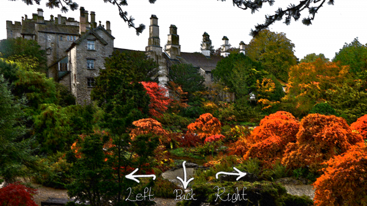

## Description

Dreamy walking sim on the web. Take a stroll and remember to breath.

Just open the index.html to start.

## Creating your own dreams

Feel free to fork the repo and create your own dreams.

1. Find suitable ambience (audio, images, gifs)
2. Add them to the repository
3. Rewrite the index.html to use your new assets

I recommend using EZGif for creating your own custom gifs.

It should be straight forward. 

Contact me if there is any problems!
